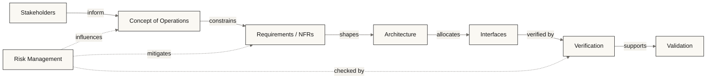

# Mermaid Traceability Example

Use this when GitHub-native rendering is more important than precise visual control.

```mermaid
%%{init: {
  "theme": "base",
  "themeVariables": {
    "background": "#F3F1EC",
    "primaryColor": "#FAF8F3",
    "primaryTextColor": "#161616",
    "primaryBorderColor": "#161616",
    "lineColor": "#6E6B67",
    "secondaryColor": "#F3F1EC",
    "tertiaryColor": "#C9C5BD"
  }
}}%%
flowchart LR
  STK[Stakeholders] -->|inform| CONOPS[Concept of Operations]
  CONOPS -->|constrains| NFR[Requirements / NFRs]
  NFR -->|shapes| ARCH[Architecture]
  ARCH -->|allocates| IF[Interfaces]
  IF -->|verified by| VER[Verification]
  VER -->|supports| VAL[Validation]

  RISK[Risk Management] -. influences .-> CONOPS
  RISK -. mitigates .-> NFR
  RISK -. checked by .-> VER
```
